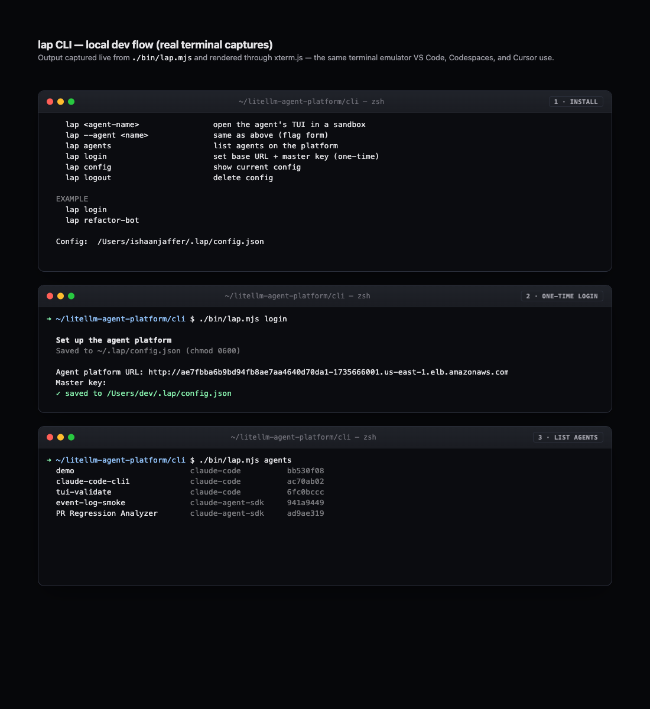

# The `lap` CLI

A single terminal command spins up a managed sandbox, attaches your local
terminal, and routes credentials through the vault so agents never see real keys.

Behaviour depends on the harness:

| Harness | Mode | How |
|---|---|---|
| `claude-code`, `codex`, `hermes`, `gemini` | **TTY** — full interactive terminal | WebSocket PTY, same feel as `ssh` |
| `claude-agent-sdk`, `opencode` | **Chat REPL** — line-by-line chat | HTTP JSON message API |

The CLI detects the harness automatically and picks the right mode.



---

## Prerequisites

- Node 18 or newer
- A running LiteLLM Agent Platform deployment (see [CONTRIBUTING.md](../CONTRIBUTING.md)
  for local dev without K8s, or the deploy guides for production)
- The platform's base URL and master key

## Install from source

```bash
git clone https://github.com/BerriAI/litellm-agent-platform.git
cd litellm-agent-platform/cli
npm install
chmod +x bin/lap.mjs
# Optional: put it on your PATH (user-owned dir, no sudo needed)
mkdir -p ~/.local/bin
ln -sf "$PWD/bin/lap.mjs" ~/.local/bin/lap
# Add ~/.local/bin to PATH if it isn't already:
echo 'export PATH="$HOME/.local/bin:$PATH"' >> ~/.zshrc && exec zsh
```

> Prefer `/usr/local/bin`? `sudo ln -sf "$PWD/bin/lap.mjs" /usr/local/bin/lap`.

## Configure (one-time)

```bash
lap login
#   Agent platform URL: https://lap.acme.dev
#   Master key:         ••••••••••••••••
#   ✓ saved to ~/.lap/config.json
```

Config is written with mode `0600`. To clear it: `lap logout`.

## Open a sandbox

```bash
lap <agent-name>              # open a sandbox for the named agent
lap --agent <name>            # same (flag form)
lap agents                    # list agents ([tui] = TTY harness, blank = chat)
lap config                    # show current config
lap logout                    # delete config
```

The agent name accepts either a human name or a UUID.

### TTY mode (claude-code, codex, hermes, gemini)

```bash
lap my-claude-code-agent
#   ✓ agent my-claude-code-agent (ac70ab02, harness=claude-code)
#   ✓ session 8c12262c
#   waiting for sandbox. ready
#   → attaching local TTY to ws://…/tty
#   (press Ctrl-D to detach)
#
#  ╭─────────────────────────────────────────╮
#  │  ✻ Welcome to Claude Code              │
#  │  cwd: /work/repo (acme/payments @ main) │
#  ╰─────────────────────────────────────────╯
#  ›
```

What happens:

1. `GET /api/v1/managed_agents/agents` resolves the name to an agent ID.
2. `POST /agents/:id/session` creates the session.
3. Polls `GET /sessions/:id` until `status=ready`.
4. Reads `tty_url` + `tty_token` from the response.
5. Opens a WebSocket to the sandbox pod's `/tty` with the token.
6. Sets the local terminal to raw mode and pipes bytes both directions.
   `SIGWINCH` is forwarded so the remote PTY tracks your window size.

Press **Ctrl-D** to detach. The remote session stays alive — reattach with
`lap <agent-name>` or `lap --resume <session-id>`.

### Chat REPL mode (claude-agent-sdk, opencode)

```bash
lap my-sdk-agent
#   ✓ agent my-sdk-agent (0f21c021, harness=claude-agent-sdk)
#   ✓ session c3970704
#   waiting for sandbox. ready
#   Chat mode — Ctrl-D to exit
#
#   >
```

Type a message and press Enter. The CLI POSTs it to
`POST /sessions/:id/message`, waits for the response, and prints it.
Repeat. Press **Ctrl-D** to end the session.

What happens:

1–3. Same as TTY mode (resolve agent → create session → poll ready).
4. Enters a readline REPL loop.
5. Each line → `POST /api/v1/managed_agents/sessions/:id/message`.
6. Response `parts[]` text is printed to stdout.

## Local dev (no K8s)

You can run lap against a local platform instance — no kind cluster, no
Fargate, no EKS. See **[CONTRIBUTING.md](../CONTRIBUTING.md)** for the full
guide. Short version:

```bash
# 1. Start the Next.js platform (port 3000)
npm run dev

# 2. Start the claude-agent-sdk harness (port 4096)
cd harnesses/claude-agent-sdk && npm run build
REPO_DIR=/path/to/any/local/repo \
LITELLM_API_BASE=https://gateway.litellm.ai/ \
LITELLM_API_KEY=sk-... \
node dist/server.js

# 3. Point your .env at the local harness so the platform skips K8s
# LOCAL_SANDBOX_URL=http://localhost:4096
# WARM_POOL_SIZE=0

# 4. Point lap at localhost
lap login   # URL: http://localhost:3000, key: whatever MASTER_KEY you set
lap my-sdk-agent
```

Sessions reach `ready` in under 2 seconds locally.

## What's running in the sandbox

- **TTY harnesses**: the actual CLI (`claude`, `codex`, …) under `node-pty`
  inside tmux so reconnects survive.
- **API harnesses**: an HTTP server wrapping the Claude Agent SDK or opencode.
- Working tree at `/work/repo`, optionally cloned at boot from `repo_url`.
- Credentials are stub placeholders — vault swaps them for real values on
  every outbound TLS connection:
  ```
  GITHUB_TOKEN=stub_github_a8f1
  LITELLM_API_KEY=stub_litellm_bb20
  ```

## Troubleshooting

| symptom | likely cause | fix |
|---|---|---|
| `✗ no agent named '…'` | wrong agent name | `lap agents` to list; `lap config` to check which platform you're authed against |
| `✗ session create failed: 401` | master key wrong | re-run `lap login` |
| `✗ ws error: 404` | agent is a non-TUI harness on an old platform | upgrade the platform so it returns `supports_tui` on session responses |
| `[ws closed]` immediately after attach | harness pod reaped or bearer token mismatch | check `lap config`; confirm `HARNESS_AUTH_TOKEN` matches `CONTAINER_ENV_HARNESS_AUTH_TOKEN` |
| chat REPL sends message but no response | network error or harness 5xx | check platform logs; `GET /sessions/:id` for `failure_reason` |

## Environment overrides

| variable | purpose |
|---|---|
| `LAP_TTY_TOKEN` | override the bearer token (normally read from `session.tty_token`) |
| `LAP_TTY_FALLBACK` | fallback WS URL when `sandbox_url` is in-cluster DNS the laptop can't reach |

## See also

- [`cli/README.md`](../cli/README.md) — CLI internals
- [`CONTRIBUTING.md`](../CONTRIBUTING.md) — local dev setup (no K8s)
- [`harnesses/claude-code/README.md`](../harnesses/claude-code/README.md) — TTY harness container + auth model
- [`harnesses/claude-agent-sdk/README.md`](../harnesses/claude-agent-sdk/README.md) — SDK harness API
- [`docs/k8s-backend.md`](k8s-backend.md) — the K8s side of sandboxes
